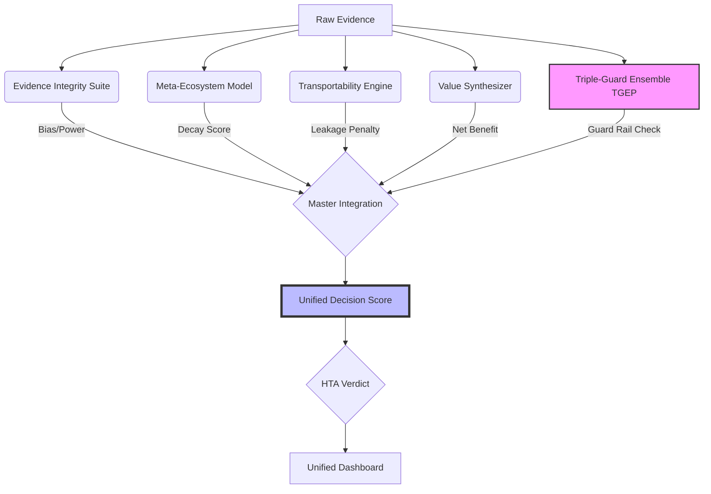

# HTA Unified Intelligence System (UIS)

**A Self-Correcting Framework for Evidence Synthesis using Triple-Guard Ensembles**

This repository contains the source code and data for the HTA Unified Intelligence System, a next-generation framework for Health Technology Assessment. It integrates five methodology engines into a single **Unified Decision Score (UDS)** to evaluate medical technologies.

## ?? System Architecture



## ?? Quick Start

### Prerequisites
*   **R** (v4.0+)
*   **Python** (v3.8+)
*   **PowerShell** (Windows) or Bash (Linux/Mac)

### Installation
1.  **Install R Dependencies:**
    ```bash
    Rscript setup.R
    ```
2.  **Install Python Dependencies:**
    ```bash
    pip install -r requirements.txt
    ```

### Usage
Run the entire pipeline with a single command:
```powershell
.\run_all_unified.ps1
```

## ?? Project Structure

*   `R/` - Core R libraries (TGEP engine).
*   `output/` - Generated results (CSVs, Figures).
*   `data/` - Input data (optional).
*   `master_integration_pipeline.R` - Main logic for UDS calculation.
*   `run_tgep_integration.R` - TGEP Guard Rail execution.
*   `update_dashboard.py` - Python script for HTML dashboard generation.
*   `HTA_Intelligence_Manuscript_Nature.md` - The draft manuscript.

## ?? Key Metrics

*   **Inf Frac:** Evidence Integrity score.
*   **FPI Score:** Resilience to evidence decay.
*   **Transportability:** Real-world efficacy retention.
*   **Guard Rail:** TGEP status ("Confirmed", "Precise Null", "Inconclusive").
*   **Action:** Recommended next step (e.g., "Request New RCT").

---
*Generated by Mahmood Ul Hassan, Feb 2026.*
