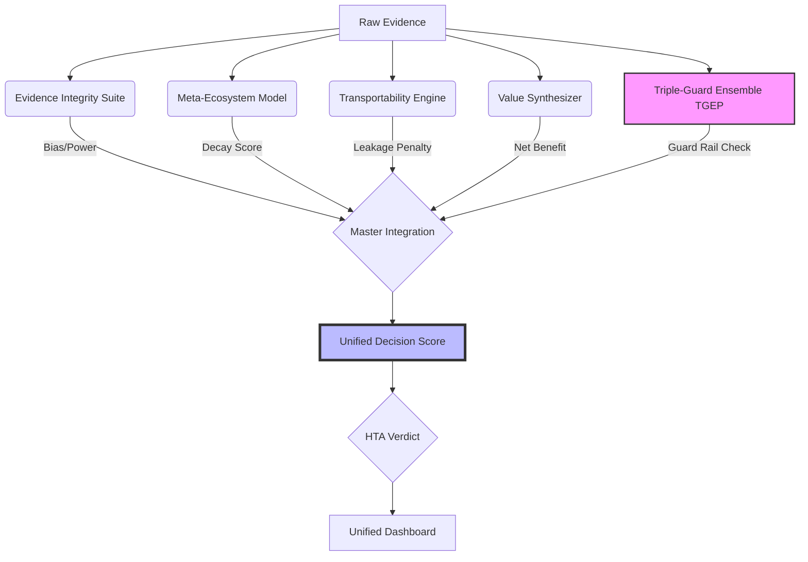

# HTA Unified Intelligence System (UIS)

**A Self-Correcting Framework for Evidence Synthesis using Triple-Guard Ensembles**

This repository contains the source code and data for the HTA Unified Intelligence System, a next-generation framework for Health Technology Assessment. It integrates five methodology engines into a single **Unified Decision Score (UDS)** to evaluate medical technologies.

## System Architecture



## Quick Start

### Prerequisites
*   **R** (v4.0+)
*   **Python** (v3.8+)
*   **PowerShell** (Windows) or Bash (Linux/Mac)

### Installation
1.  **Install R Dependencies:**
    ```bash
    Rscript setup.R
    ```
2.  **Install Python Dependencies:**
    ```bash
    pip install -r requirements.txt
    ```

### Usage
Run the entire pipeline with a single command:
```powershell
.\run_all_unified.ps1
```

## Project Structure

*   `src/R/TGEP.R` - Triple-Guard Ensemble Pooling engine (three guard cores).
*   `src/R/master_integration_pipeline.R` - Main logic for UDS calculation.
*   `src/R/run_tgep_integration.R` - TGEP Guard Rail execution.
*   `src/python/query_hta.py` - Command-line interface for exploring results.
*   `src/python/update_dashboard.py` - HTML dashboard generation.
*   `output/` - Generated results (CSVs, JSON, figures).
*   `data/` - Input data (optional).
*   `config.R` - Centralised pillar weights and thresholds.
*   `tests/` - R logic suite (`run_tests.R`) and Python contract/CLI tests.
*   `HTA_Intelligence_Manuscript_Nature.md` - The draft manuscript.

## Exploring Results (CLI)

After the pipeline has produced `output/master_unified_intelligence.csv`, use
the query CLI to inspect the 44 scored technologies:

```bash
# List every technology with its verdict and Unified Decision Score
python src/python/query_hta.py --list

# Full metric card for one technology (pillars + TGEP guard rail)
python src/python/query_hta.py CD001155_pub3_data

# Side-by-side comparison of two technologies
python src/python/query_hta.py --compare CD001155_pub3_data CD000028_pub4_data

# Machine-readable JSON (works with --list, a query, or --compare)
python src/python/query_hta.py --list --json
```

Exit codes: `0` success, `1` database missing/invalid, `2` bad `--compare`
arguments, `3` technology ID not found. Pass `--data <path>` to point at an
alternative results CSV.

## Testing

```bash
# Python contract + CLI tests (also invokes the R logic suite if Rscript is on PATH)
python -m pytest tests/

# R logic suite directly (requires the `testthat` and `data.table` packages)
Rscript tests/run_tests.R
```

`tests/run_tests.R` exits non-zero if `testthat` is missing or any R assertion
fails, so a green Python suite genuinely reflects a passing R suite.

## Key Metrics

*   **Inf Frac:** Evidence Integrity score.
*   **FPI Score:** Resilience to evidence decay.
*   **Transportability:** Real-world efficacy retention.
*   **Guard Rail:** TGEP status ("Confirmed", "Precise Null", "Inconclusive").
*   **Action:** Recommended next step (e.g., "Request New RCT").

---
*Generated by Mahmood Ul Hassan, Feb 2026.*
