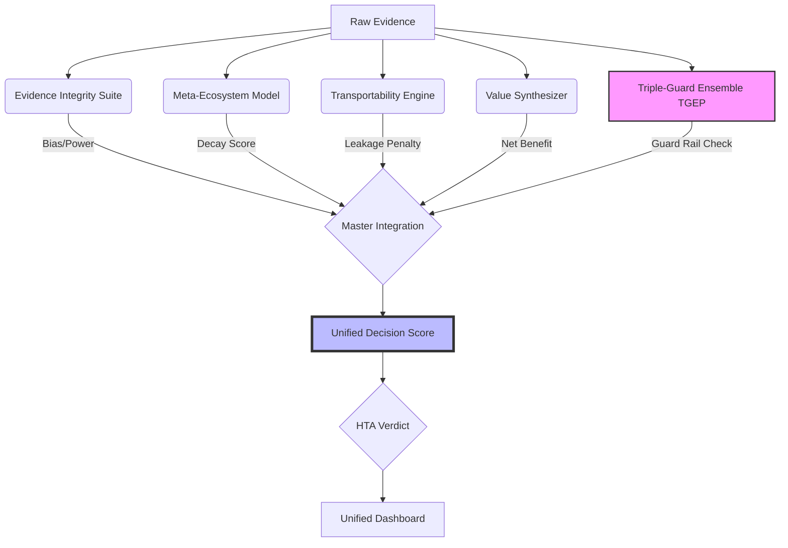

# HTA Unified Intelligence System (UIS)

**A Self-Correcting Framework for Evidence Synthesis using Triple-Guard Ensembles**

This repository contains the source code and data for the HTA Unified Intelligence System, a next-generation framework for Health Technology Assessment. It integrates five methodology engines into a single **Unified Decision Score (UDS)** to evaluate medical technologies.

## System Architecture



## Quick Start

### Prerequisites
*   **R** v4.0+ (with `metafor`, `data.table`, `dplyr`, `ggplot2`, `jsonlite`, `testthat`)
*   **Python** v3.8+
*   **Bash** (Linux/macOS) or **PowerShell** (Windows)

### Installation

Install R dependencies:
```bash
Rscript setup.R
```

Install Python dependencies:
```bash
pip install -r requirements.txt
```

Or use Docker for a fully reproducible environment:
```bash
docker build -t hta-uis .
docker run --rm -v "$PWD/output:/app/output" hta-uis
```

### Usage

Run the full pipeline:

```bash
# Linux / macOS
./run_all_unified.sh

# Windows
.\run_all_unified.ps1
```

Either entrypoint runs the same six stages:
1. QA tests (`tests/test_logic.R`)
2. Initial integration (`src/R/master_integration_pipeline.R`)
3. TGEP guard rail (`src/R/run_tgep_integration.R`)
4. Final integration (re-runs `master_integration_pipeline.R` with TGEP results)
5. Narrative generation + database archival (`src/python/`)
6. Dashboard refresh + manifest (`src/python/`)

### Tests

```bash
# R logic tests
Rscript tests/run_tests.R

# Python unit + contract tests
pytest tests/
```

Or via the Makefile:

```bash
make install    # R + Python deps
make test       # R logic + Python units
make run        # full pipeline
make docker     # build reproducibility container
```

## Project Structure

*   `src/R/` — Core R pipeline (TGEP, master integration, sensitivity).
*   `src/python/` — Dashboard, narratives, archive, manifest, CLI query tool.
*   `R/` — Auxiliary R analyses (`meta_audit.R` — meta-analysis of pipeline output).
*   `tests/` — R logic suite and Python verification contract.
*   `config.R` — Centralised weights, thresholds, divergence parameters.
*   `output/` — Generated CSVs, JSON, plots, archive, manifest (gitignored).
*   `data/input/` — Drop user CSVs here for `src/R/ingest_external_data.R`.
*   `Unified_HTA_Dashboard.html` — Static dashboard, updated in place by the pipeline.
*   `HTA_Intelligence_Manuscript_Nature.md` — Draft manuscript.

## Configuration

All thresholds and weights live in `config.R` (`HTA_CONFIG`). Changes there propagate to every pipeline stage and are verified by `tests/test_logic.R`.

| Setting | Default | Used by |
|---|---|---|
| `weights.integrity` | 0.30 | UDS calculation |
| `weights.stability` | 0.25 | UDS calculation |
| `weights.transport` | 0.25 | UDS calculation |
| `weights.value`     | 0.20 | UDS calculation |
| `thresholds.immutable` | 70 | Verdict classification |
| `thresholds.conditional` | 40 | Verdict classification |
| `thresholds.fragile` | 20 | Verdict classification |

## Environment Variables

| Variable | Purpose |
|---|---|
| `HTA_MODELS_DIR` | Parent directory containing sibling engine repos (Evidence Integrity Suite, Meta-Ecosystem Model, Transportability Engine, Value-Based HTA Engine). Defaults to the repo's grandparent. |
| `PAIRWISE70_ROOT` | Location of the `Pairwise70` dataset (`.rda` files consumed by TGEP). Auto-detected from common locations if unset. |

When sibling engine outputs are missing, the pipeline reports `MISSING (will use defaults)` and substitutes neutral defaults; verdicts are still produced.

## Key Metrics

*   **Inf Frac** — Evidence Integrity score (from Evidence Integrity Suite).
*   **FPI Score** — Resilience to evidence decay.
*   **Transportability** — Real-world efficacy retention.
*   **Guard Rail** — TGEP status (`Confirmed`, `Precise Null`, `Inconclusive`).
*   **UDS** — Unified Decision Score in [0, 100].
*   **DCI** — Data Completeness Index (which engines contributed).
*   **Action** — Recommended next step (e.g. `Request New RCT`).

## Citation

See `CITATION.cff` and `.zenodo.json`.

---
*Generated by Mahmood Ul Hassan, Feb 2026.*
